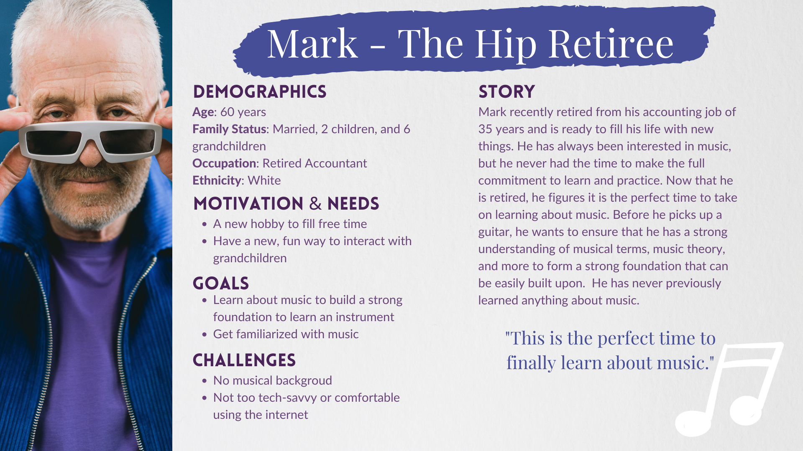
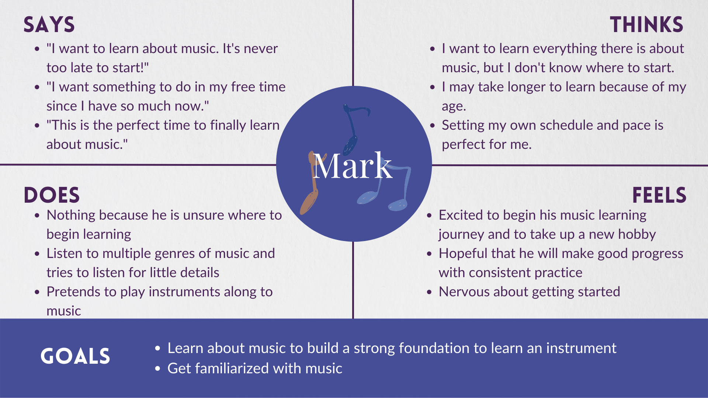
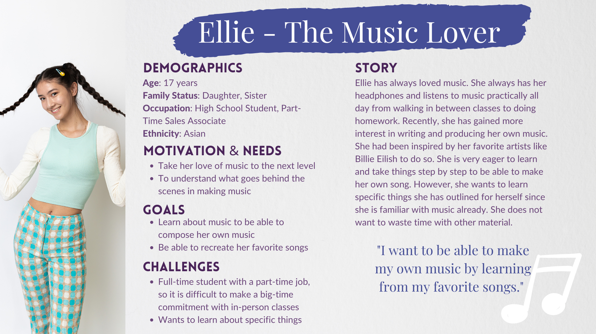
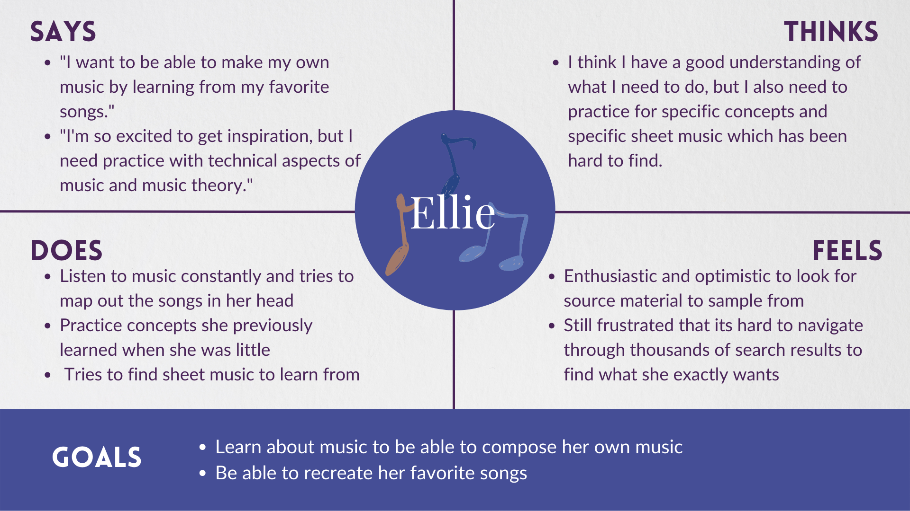
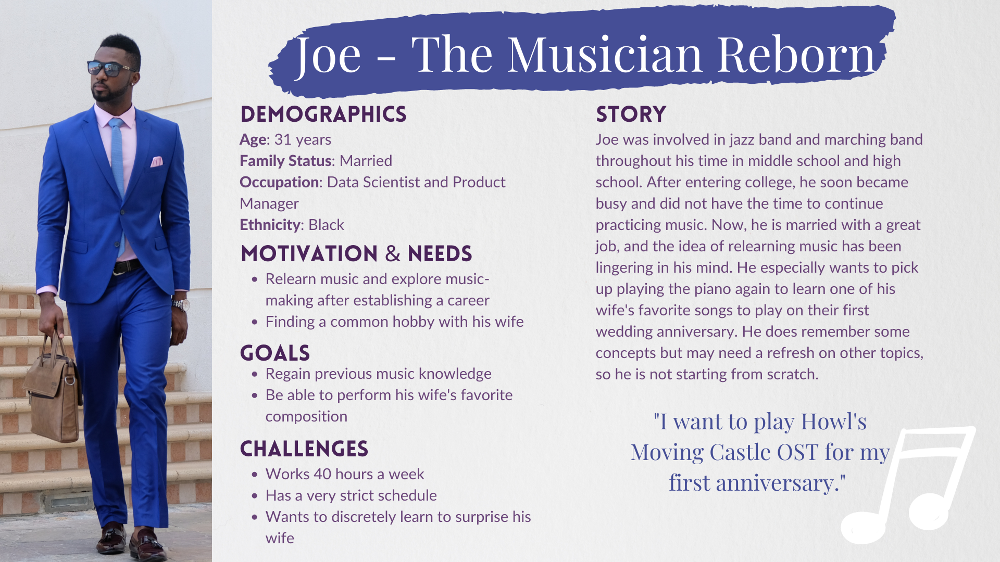
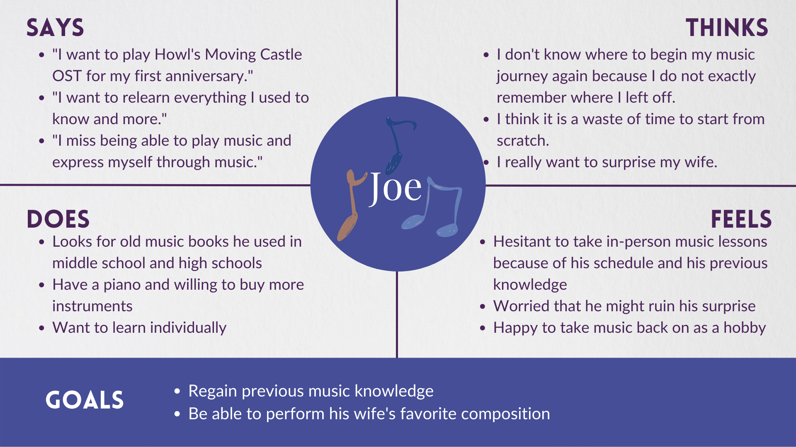
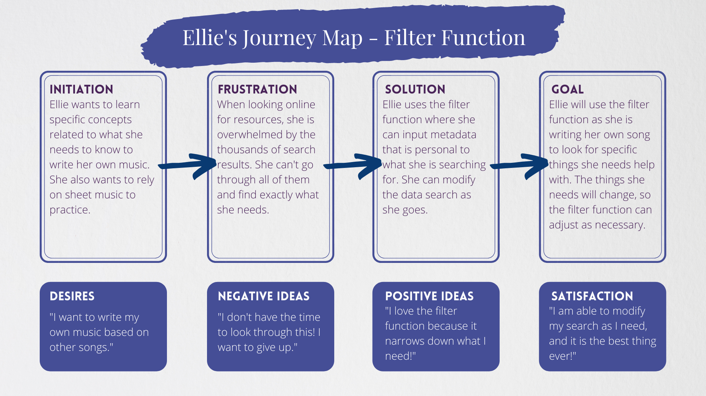
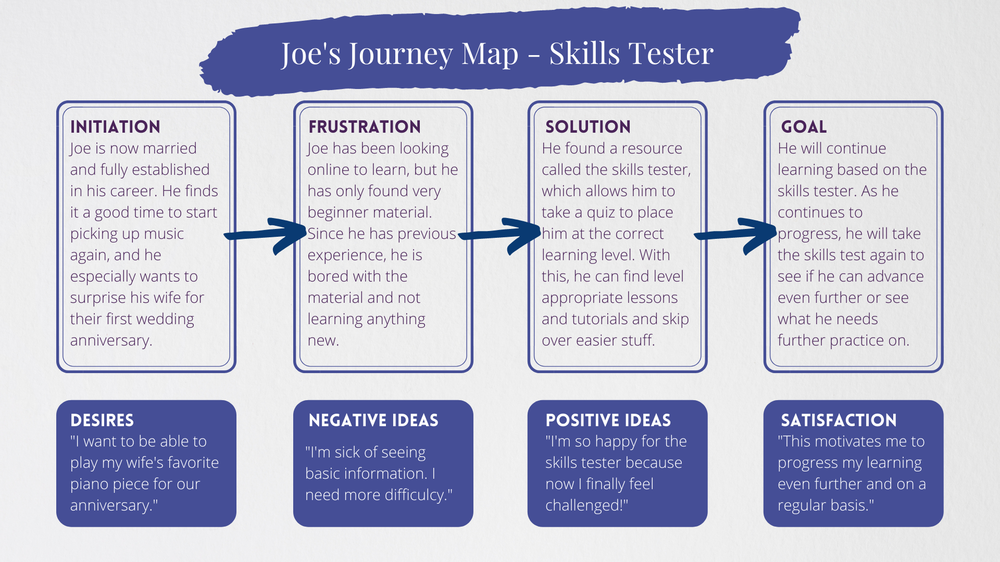

# Personas and Scenarios

### The Purpose of Storytelling

Researchers and designers are reminded through UX Storytelling that the experience must be user-centered. UX storytelling allows researchers to reflect on the underlying feelings and desires that users may have when completing a task and ensure that they are satisfied by the project's results by using think no longer websites based on heuristic principles and user interviews as data points. By designing personas, I will be able to think more broadly about the target consumers and better understand how the current system fails to satisfy their needs.

### Design Features 

Using information from previous testing, I plan to implement 3 design features to improve usability: 
* **Progress Tracker:** allow for music learners to keep track of their learning and progress by mapping out important topics and including subtopics with a progress bar to see how far along they have come
* **Filter Function:** create an extensive possibility of filter options and categorize them easily based on needs that users may have when searching for musical topics. This will allow them to easily narrow down their choices from the thousands of options available to them on the internet. Some examples of those filters are: genre of music, lesson type, sheet music, etc. 
* **Skills Tester:** to help people with previous music knowledge and expereince understand what are their needs and place them in the appropriate level of study. 

### Persona & Empathy Map

#### Mark - The Hip Retiree

#### Ellie - The Music Lover 

#### Joe - The Musician Reborn

### Scenarios & Journey Map

#### 1. Mark's Scenario - The Progress Tracker

> *This progress tracker allows for music learners to keep track of their learning and progress by mapping out important topics and including subtopics with a progress bar to see how far along they have come.*

##### Why
Mark has always wanted to learn anything and everything about music. He has never found the time to do so because he has always been so busy with work and spending time with his family. However, now he is recently retired, so he has all the time on his hands to learn something new. He figures this is the perfect time to start his music learning journey. Ideally, he wants to learn in the comfort of his own home because it is hard for him to travel back and forth to classes. He also wants to go at his own pace and be able to learn whenever he wants to or feels like it. His son made him aware that online resources are perfect for him, but he doesn’t know where to start.

##### How
Mark has found an online resource and gets started. However, as he continues to log on everyday, he notices that he keeps learning the same music topics over and over again. He gets frustrated because he doesn’t know exactly where he left off or where to begin again. He tries to write down where he stopped last time, but it is hard to locate. Therefore, he finds the progress tracker. This progress tracker allows him to keep track of everything he has already covered and everything there is to come in future lessons. It provides a clear outline of main topics for lessons, as well as subtopics, so everything is very clear for him to follow. There is also a progress bar that he can see as visual evidence of progress. With this, he is able to log on and be exactly where he needs without struggling to find his spot. It also motivates him to continuously study because of the progress bar and seeing how far he is improving on a daily basis. Now, he learns about music everyday and enjoys doing so.

#### 2. Ellie's Scenario - The Filter Function

> *The filters and categorization features create an extensive possibility of ways to filter through all the  options available on the internet easily based on needs that users may have when searching about music. This will allow them to easily narrow down their choices from the thousands of options available to them on the internet. Some examples of those filters are: genre of music, lesson type, sheet music, etc.* 

##### Why
Ellie has always been a lover of music. Ever since she could walk and talk, she began to dance and sing. Now as a teenager, she still loves music and listens to it at any opportunity she gets. From walking in between classes to doing homework, you will find Ellie with her headphones listening to her newest playlist. Now, she wants to take her love of music to the next level by writing her own song. She was inspired by her favorite singer-songwriter, Billie Eilish. She wants to be able to write and perform her own music like Billie. Because she is a student, she wants to learn at home on her own time and figures online is the best way to go.

##### How
Ellie begins her learning by searching for specific topics she wants to learn about and look for. However, she is extremely overwhelmed by the thousands of search results that come up when she looks up just one idea. She does not have the patience nor time to go through each of those search results, and even the ones she did look through did not have sufficient information or relevant thoughts. Ellie lands on the filter function of the online resource, and this altered her whole experience. She was able to customize her search with metadata pertinent to her needs, and she could input details to tailor search results. As she is progressing with her music writing, new things she wants to research come up, so she is able to adjust those topics with the filter function as she goes. This filter function also aided heavily with looking for the sheet music she wanted because there were so many to go through. Now, her search results are vastly reduced.

#### 3. Joe's Scenario - The Skills Tester
 
 > *The skills tester will help people with previous music knowledge and expereince understand what are their needs and place them in the appropriate level of study.*

##### Why
Joe was immersed in the music world as a child. He was enrolled in music lessons and eventually ended up playing in the jazz band and marching band in his middle school and high school. Unfortunately, when he entered college, he found himself getting extremely busy and slowly stopped playing music. After college, he got a full-time job at a big technology company, where he met his wife. Now, he is married and well-established in his career. Because of this, he finds it a good time to pick up some old hobbies again. The one he is especially interested in is going over music theory to be able to read music proficiently again. He wants to learn his wife’s favorite piano piece and perform it for her for their first wedding anniversary.

##### How
Joe wants to learn after hours, after work, and the fitting way would be to learn online to fit his schedule and needs. He goes online to begin his music journey again. He sees many lessons, but he finds that everything is very repetitive and only at the beginner level upon his initial research. He is tired and bored of learning old material he still remembers and feels discouraged about picking up music again. One day, he comes across the skills tester for an online resource and lights up because it seems perfect for him. The skills tester is an online quiz that tests music theory, terms, and concepts and then places the user in the appropriate level of study. He took the test and got placed in the perfect level for him. Now, he feels challenged and is actually learning new things every time he goes on to practice. He was able to make very good progress and felt like he was approaching the level he was at when he was younger. He is able to understand and read the sheet music for his wife’s favorite piano piece and continues to practice everyday.

### Reflection

* I had fun creating personas, as it helped me better understand why the users would use the features and the positive impact it will have on their music learning journey.

* My limitation was that I was somewhat restricted in what I was able to research for each demographic, but I asked around online to have personal stories provided by those who meet those demographics to supplement information.

* From this research, I was able to understand how I should focus on resolving any frustration in the music learning process.

* This confirmed that the three design features would be very useful to implement on the website. 
