# Assignment 6: Interface Design
Leah Kim | DH 110 

## Description 
The goal of the project is to redesign the current website for Dolmetsch Online to make it more accessible and easier to use. Currently, it has failed many components of both heuristic and user testing. Therefore, through contextual inquiry, personas and scenarios, and low-fidelity prototyping, I have gotten to the digitized stage of wireflows and design. I have made sure to include the features the original website was missing while keeping it simple and organized so many users can access it.

## URLS
* [Digitized Wireflow]()
* [Test Screens](https://www.figma.com/file/gRPsoX1IyXzslvBWcAFNdP/DH110-A06?node-id=0%3A1)
* [Impression Test]()

## Chosen Wireframe
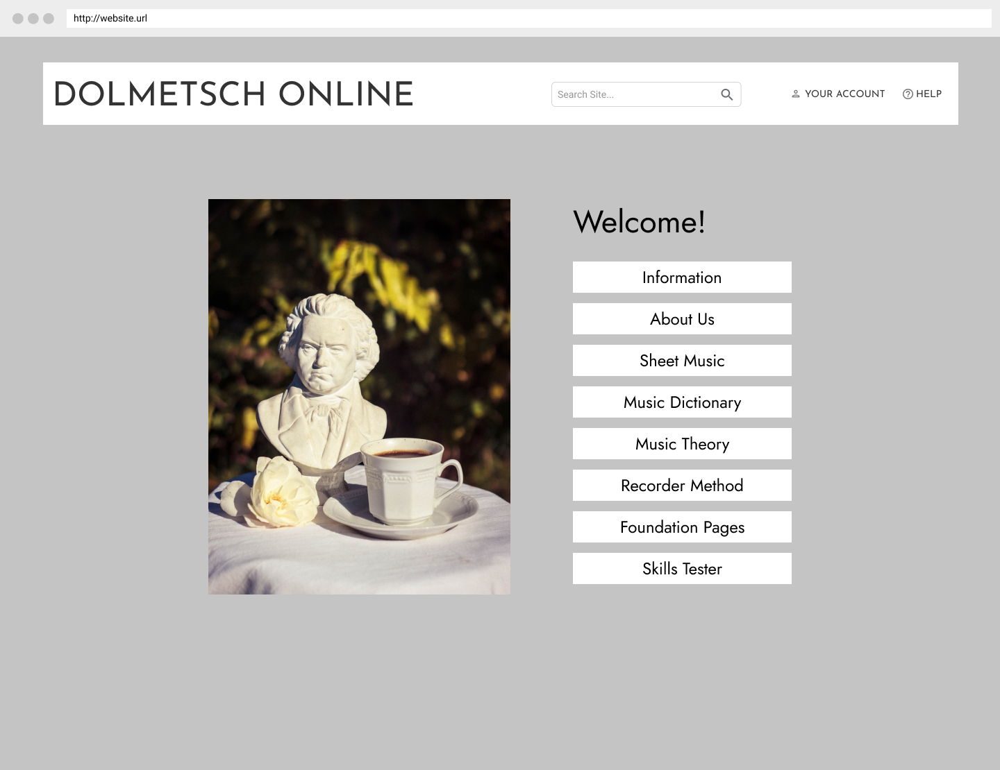
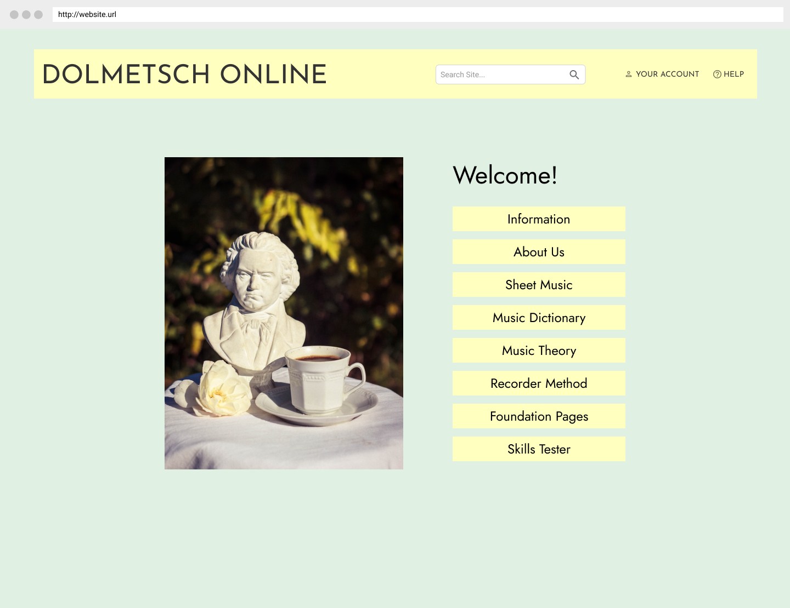

## Screen Design

### Layout Design:
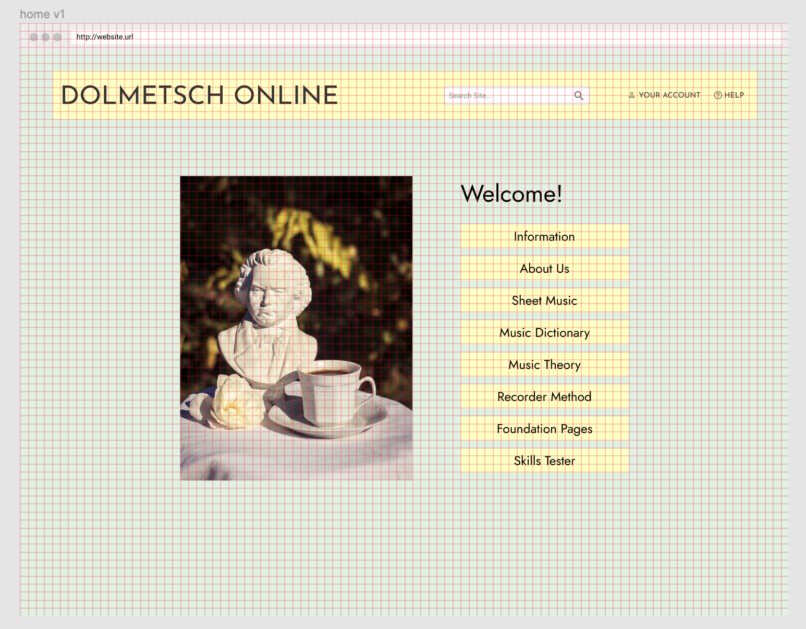

### Typographic Variations:
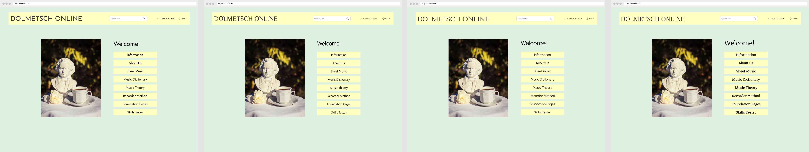

### Shape Variations:
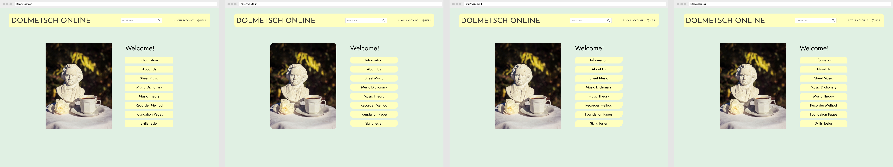

### Color Variations:
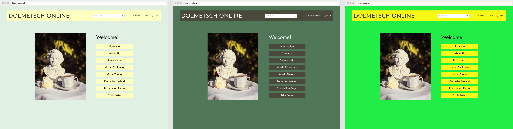

## Impression Test:
Here is the link to the [impression testing](). My participant did not feel comfortable being recorded, and due to it being conducted in Spanish, I opted to translate and transribe the audio recording. I gave the user 5 seconds to look at the first screen and asked for her general impression of the site. Then, I showed her the screen variations and asked her to compare it to the first screen, pointing out things she liked or disliked about each variation.

### Findings:
**Overall Impression:**
> The user could 

**Typography:**
> The user preferred 

**Shape:**
> The user indicated 

**Color Scheme:**
> The user preferred

## Revisions:
**Color Contrast**
While testing color contrast on my original design, I noticed that the button to background contrast was inadequate. Therefore, I took one of the color variations and modified it, so it would pass the contrast tests. I could have also used the same design, but with a border around each box.
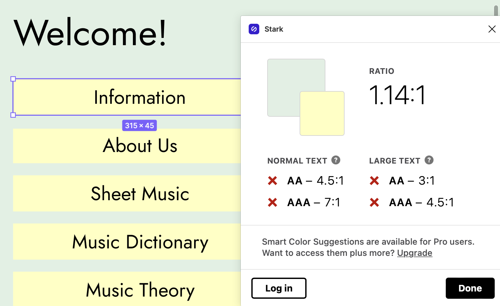
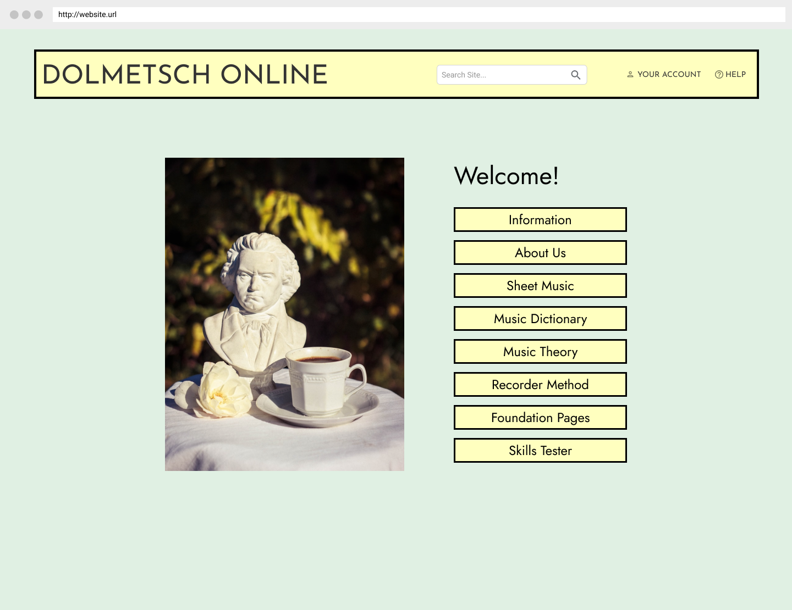

## Final Design:

## Color Contrast Check
All of my design elements passed the recommended 4.5:1 ratio.

### Text vs. Background
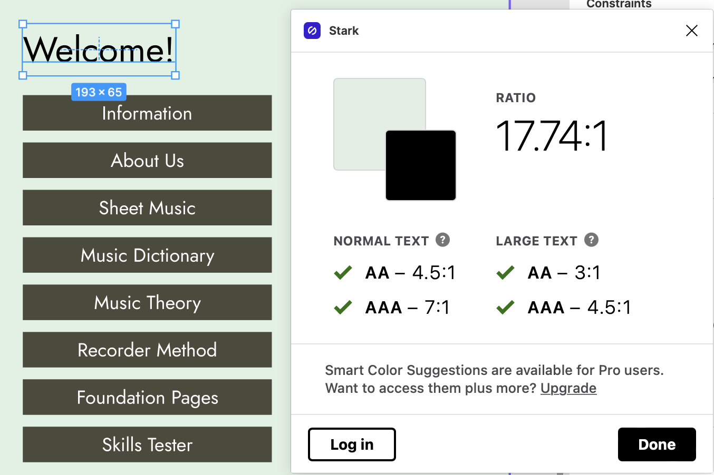
### Button vs. Background
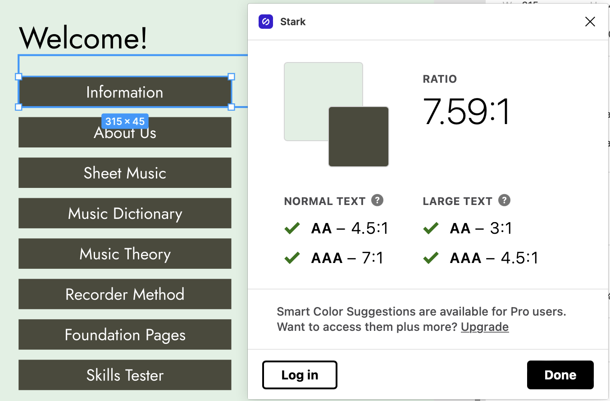
### Button Label vs. Button
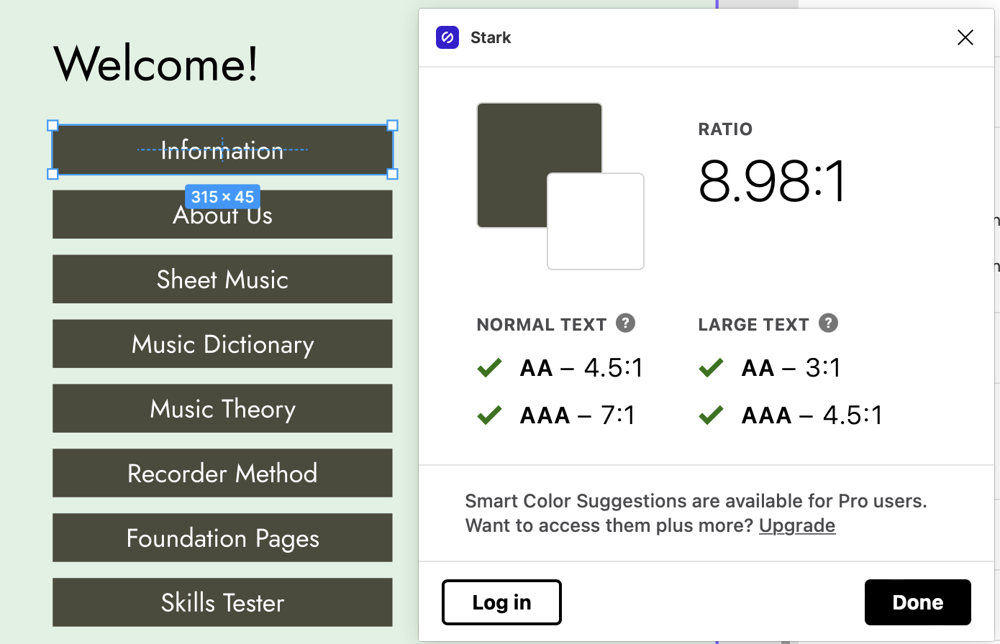

## Design System:
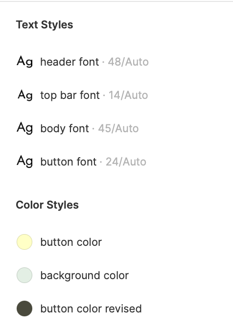
* Typeface:
  * Family: Europa
    * Header: Bold, Size 32
    * Button Labels: Bold, Size 24
    * Body: Regular, Size 16
    * Pathname: Regular, Underlined, Size 16
* Color Scheme:
  * Header Color: 40696F
    * Subheader / Text Color: 1C414B
    * Button Color: 1C7C88
    * Alternate Text Color: FFFFFF
    * Background Color: EBF9FF 
* Layout Grid:
  * 4 columns by 30 rows
    * Columns: 
        * Margins: 28
        * Gutter: 20
    * Rows:
        * Height: 35
        * Gutter: 5

## Design Decisions:
**Typeface:**
> I chose 

**Color Scheme:** 
> I took inspiration from the original website, but due to color contrast, I modified to my own color preferences from there. I wanted a classy and simple look, so I went with the selected colors.

**Layout Grid:**
> I chose to use the grid option with 15px because personally, that one was the easiest to have all my elements centered and aligned the way I wanted it to. I did not find the columns and rows option to be helpful since I am designed a website rather than an app.

