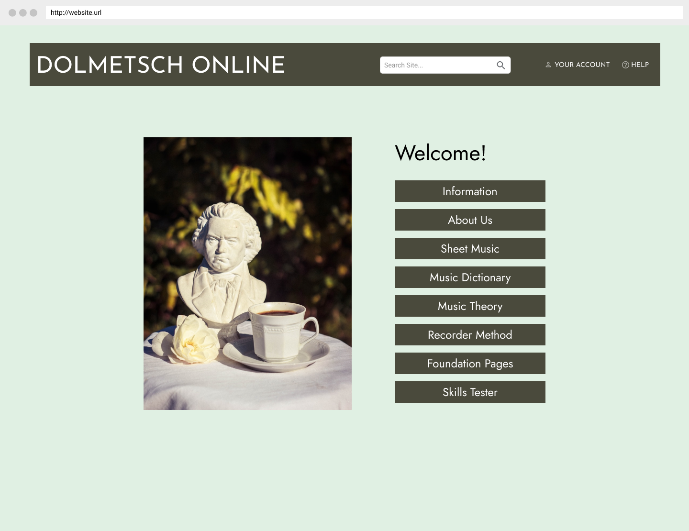

# Assignment 6: Interface Design
Leah Kim | DH 110 

## Description 
The goal of the project is to redesign the current website for Dolmetsch Online to make it more accessible and easier to use. Currently, it has failed many components of both heuristic and user testing. Therefore, through contextual inquiry, personas and scenarios, and low-fidelity prototyping, I have gotten to the digitized stage of wireflows and design. I have made sure to include the features the original website was missing while keeping it simple and organized so many users can access it. I incorporated layout features, typography, shapes, and colors to improve the design.

## URLS
* [Digitized Wireflow](https://www.figma.com/file/h9HHhIkJXN9FrmBs2t9uUU/DH110-Wireflow?node-id=0%3A1) (Work In Progress)
* [Test Screens](https://www.figma.com/file/gRPsoX1IyXzslvBWcAFNdP/DH110-A06?node-id=0%3A1)
* [Impression Test](https://docs.google.com/document/d/1307xjscFXHnr1prwZGvhlA7D4_dW_IkSPceggIUwF5s/edit?usp=sharing)

## Chosen Wireframe

## Screen Design

### Layout Design:

### Typographic Variations:

### Shape Variations:

### Color Variations:

## Impression Test:
Here is the link to the [impression testing](https://docs.google.com/document/d/1307xjscFXHnr1prwZGvhlA7D4_dW_IkSPceggIUwF5s/edit?usp=sharing). My participant did not feel comfortable being recorded, and due to it being conducted in Spanish, I opted to translate and transribe the audio recording. I gave the participant 5 seconds to look at the first screen and asked for her general impression of the site. Then, I showed her the screen variations and asked her to compare it to the first screen, pointing out things she liked or disliked about each variation.

### Findings:
**Overall Impression:**
> The user liked at least one variation for each type. She was able to figure out that this was a music website based on the image and the context of the buttons. She provided helpful suggestions and described her thoughts on the designs. She liked the overall look of the website design showed to her intiially. The participant liked the first typographic, first shape, and first and second color variations.

**Typography:**
> The participant preferred the first font combination of the four options. She said the first option is very simple and easy to read, which is why it was chosen. She liked the minimalist look. She expressed that the last option was her least favorite, particularly because of the secondary font in the body of the frame. She said it was too bulky and distracting, making it unideal for the website. The other two options sat in between.

**Shape:**
> The participant said that the first option is the best choice. This is because for a music website, she thinks a classic, simple look is fitting, and the rectangular header and buttons achieve that look. She mentioned the second option of the ovals seemed childish. She also showed dislike for the last two options because of the irregular shapes. 

**Color Scheme:**
> The participant immediately expressed disdain for the contrast option, or the last option. She explicitly said it was ugly and distracting from the contents of the wireframe. She said it was not fitting for a music website. On the other hand, she very much liked the first two light mode and dark mode variations and said either or could be a great choice for a final design.

## Revisions:

### Color Contrast
* While testing color contrast on my original design, I noticed that the button to background contrast was inadequate. Therefore, I took one of the color variations and modified it, so it would pass the contrast tests. I could have also used the same design, but with a border around each box.
* I conducted a brief second round of impression testing found [here](https://docs.google.com/document/d/1fL82GICoCVBPeAlspD23MXGGwm8ZXMJYsHzqrpSHH5c/edit?usp=sharing) to help choose between the options I landed on.

### Option 1

### Option 2

## Final Design:

## Color Contrast Check
All of my design elements passed the recommended 4.5:1 ratio.

### Text vs. Background

### Button vs. Background

### Button Label vs. Button

## Design System:

* Typeface:
  * Family: Josefin Sans
    * Header: Regular, Size 48
    * Button Labels: Regular, Size 14
  * Family: Jost
    * Body: Regular, Size 45
    * Button Labels: Regular, Size 24
* Color Scheme:
  * Header Color: 4A4A3C
    * Text Color: FFFFFF
    * Button Color: 4A4A3C
    * Alternate Text Color: 000000
    * Background Color: E0F0E3 
* Layout Grid:
  * Grid 15px

## Design Decisions:
**Typeface:**
> I chose this font combination because I liked the simplicty and readability of it. I opted for a Sans Serif design because I do not like the ticks on the letters, and I think it is more visually appealing. Therefore, I landed on Josefin Sans and Jost because they are both Sans Serif and mesh well together.

**Color Scheme:** 
> I took inspiration from the original website color scheme, but due to color contrast, I modified to my own color preferences from there. I wanted a classy and simple look, so I went with the selected colors. I liked having one pastel color, and I darkened my chose color to achieve appropriate contrast.

**Layout Grid:**
> I chose to use the grid option with 15px because personally, that one was the easiest to have all my elements centered and aligned the way I wanted it to. I did not find the columns and rows option to be helpful since I am designed a website rather than an app.
