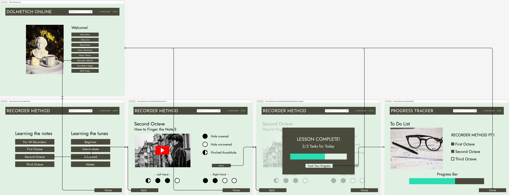

# Assignment 7: High Fidelity Prototype
Leah Kim | DH 110

## Overview
### Summary
I created an interactive high fidelity prototype to redesign and improve the original website of Dolmetsch Online, a music theory learning online platform. The prototype is designed to support three tasks, while maintaining UX/UI standards.

### Process
I used Figma to create this prototype and based the design on my sketched low fidelity prototype and interface design from previous assignments. I created a first version of a high fidelity prototype, and then I modified it using my peers' input for a second version.

### Purpose
The goal of this interactive prototype is to evaluate the updated Dolmetsch Online website's interface and functionality. It determines if completing tasks, using the proposed feature, and following the desired interaction flow are simple for the user.

## Tasks
This interactive prototype supports 3 tasks:
1. Accessing the progress tracker
2. Utilizing the filter function
3. Creating an account and logging in

## Wireflows
For clarity and readability, I separated the flow by task:

### Task 1 Flow:

### Task 2 Flow:

### Task 3 Flow:

### Full Wireflow:
[Access Full Wireflow](./full.png)

## Prototype 1:
[Access Prototype 1](https://www.figma.com/proto/h9HHhIkJXN9FrmBs2t9uUU/DH-110-Prototype?node-id=2%3A29&scaling=scale-down&page-id=0%3A1&starting-point-node-id=2%3A29)

For this iteration of prototyping, I mirrored my low fidelity protoype. However due to the complexity of one of my original tasks, I changed it to something that is better achievable in this prototype.

## Cognitive Walkthrough

### Cognitive Walkthrough:
[Access Cognitive Walkthrough Data]([https://docs.google.com/spreadsheets/d/15HXr6no3cgMHEjqRma5v7XQxy8vVqJVEQpGMI2l1gDA/edit?usp=sharing](https://docs.google.com/document/d/1MYY22PRkMfMwxE9CeUTI_OL67qySY0pS8TggQ4nPl-4/edit?usp=sharing))

Overall, I think the cognitive walkthrough went smoothly. My peers were able to go through the prototype and navigate the tasks as intended. They provided useful feedback that I implemented in my second iteration.

However, they did point out some areas of improvement:

1. Making the header clickable

2. Making home and back button more visible

## Prototype 2 (Revision):

[Access Prototype 2](https://www.figma.com/proto/FiP5xIDKEKWrtnXJAAugWU/DH-110-Project?node-id=179%3A1110&scaling=scale-down&page-id=179%3A1087&starting-point-node-id=179%3A1110)
