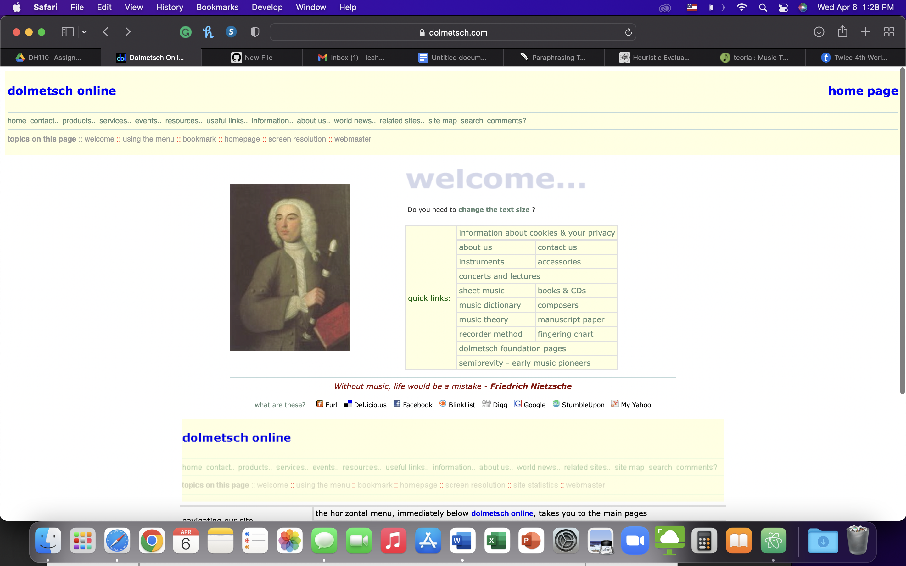
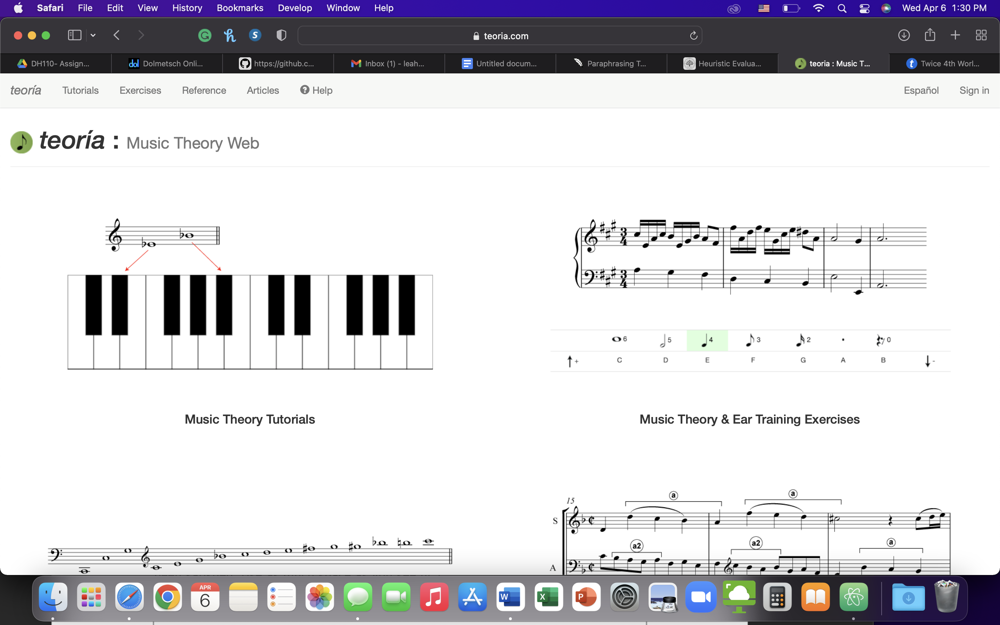
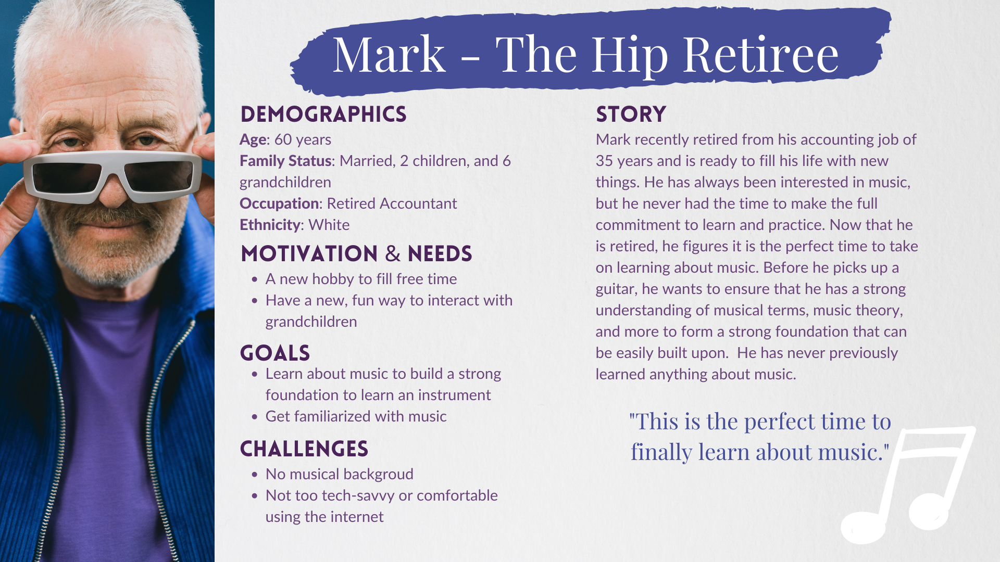
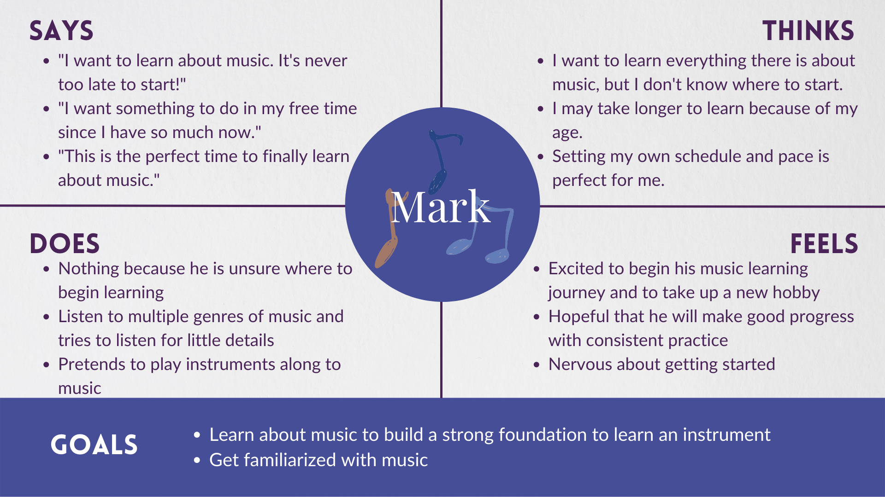
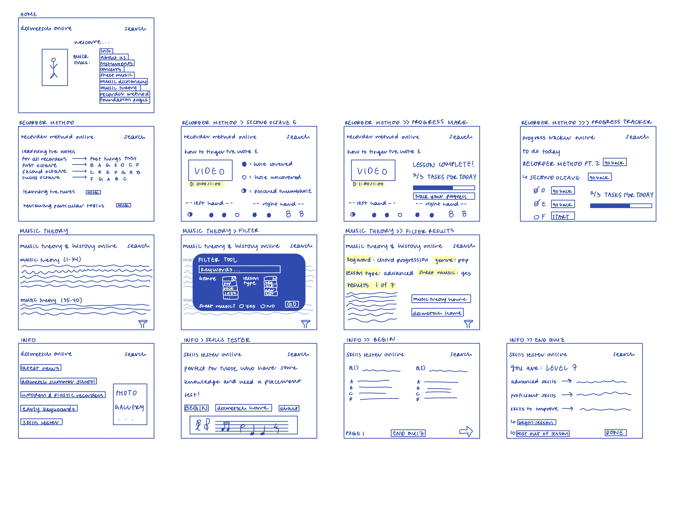
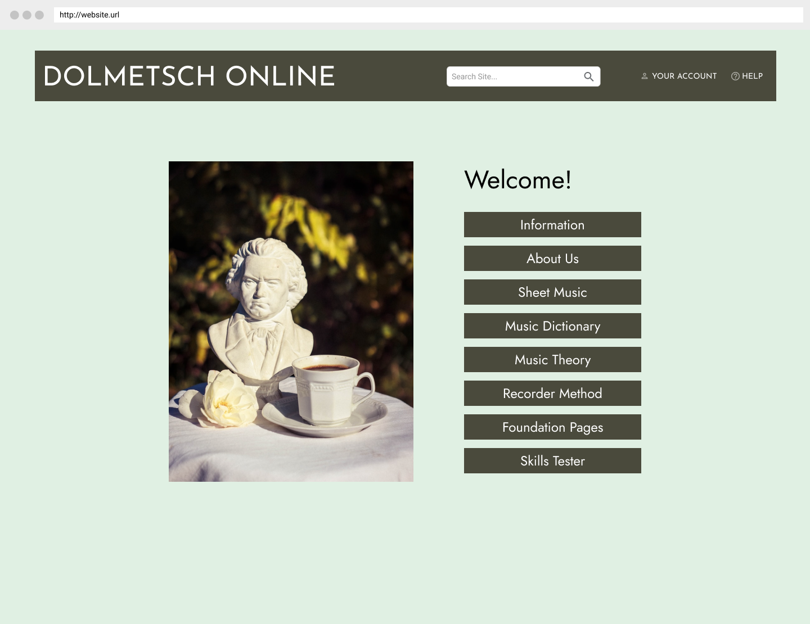
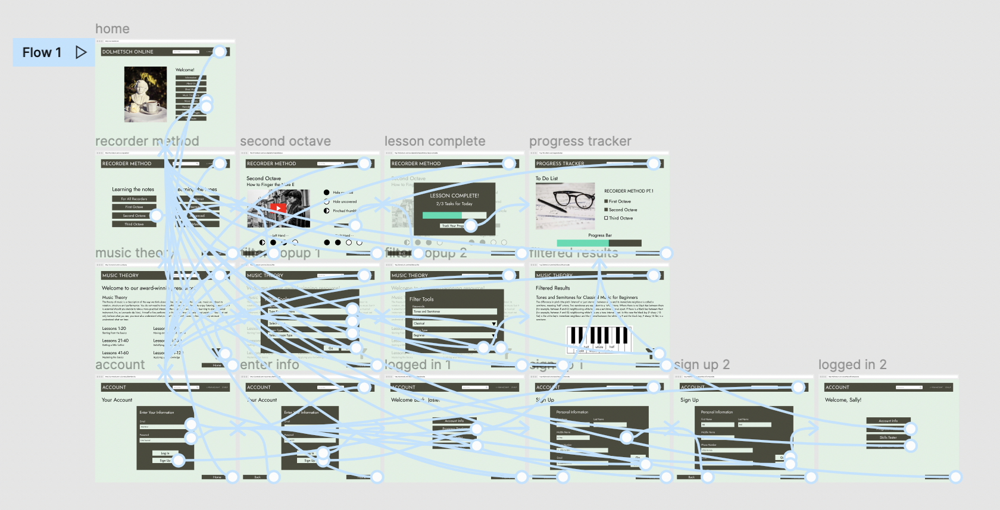

# Redesigning Dolmetsch Online

## Leah Kim

## Introduction

The goal of this course was to create a UX project that improves upon a music learning website or app for a middle-aged man to easily use and follow. Music learning has evolved over the last few years, adapting to the development of technology. What was previously only available in-person is now widespread on the internet through various learning platforms. However, finding a usable resource for certain demographics can be challenging due to the complexities or design of websites and apps. Therefore, through this project, I aimed to redesign Dolmetsch Online, a music theory website, so that my target demographic can utilize it as a learning resource.

## Design Statement

**The redesigned Dolmetsch Online website serves all ages and learning levels, including middle-aged men, by providing various types of music theory lessons and interactive features that allows learning anytime and anywhere.**

Based on research outlined below, I implemented 3 design features for an improved user experience:
* **Progress Tracker:** allow for music learners to keep track of their learning and progress by mapping out important topics and including subtopics with a progress bar to see how far along they have come
* **Filter Function:** create an extensive possibility of filter options and categorize them easily based on needs that users may have when searching for musical topics. This will allow them to easily narrow down their choices from the thousands of options available to them on the internet. Some examples of those filters are: genre of music, lesson type, sheet music, etc. 
* **Account Function:** allow user to create a profile and log in to keep progress and customize features

## Competitor Analysis

### Heuristics Evaluation

The first step in the process was to conduct a heuristic evaluation of two music-learning websites to see how they follow or do not follow Nielson's 10 Usability Heuristics Evaluation based on a severity ranking of 1 to 3, where 1 is the least severe and 3 is the most severe. The two selected websites were [Dolmetsch Online](https://www.dolmetsch.com/index.htm) and [Teoria](https://www.teoria.com).

Dolmetsch Online performed poorly on 9 out of 10 of the heuristics and had high severity ratings on many of them. It is an outdated and unorganized website that is difficult to navigate even for skilled users. Teoria performed better, but it still had its issues from a heusitics standpoint. 

From these two websites, they were both lacking in the following heuristic categories:
* Visibility of system status
* User control and freedom
* Flexibility and efficiency of use

However, they both did well with the following category:
* Consistency and standards

Find the full evaluation [here](https://leahkim07.github.io/DH110/assignment01/).
	
### Usability Testing

The goal of usability testing (UT) is to improve a product's usability by monitoring and testing consumers and collecting feedback. UT uses a heuristic evaluation to discover specific problems and then tests whether the product is effective, efficient, and satisfactory to users. UT is the best technique to analyze the participant's behaviors and thoughts while observing them navigate the product, as opposed to heuristic evaluations or other evaluation techniques.

In my pilot UT, I tested the website Dolmetsch Online for tasks that examine whether a user can find information about music theory. The user's first thoughts of the website are assessed in the pre-test questionnaire. Three tasks were created and assigned to view usability. The post-test questionnaire measures the level of user satisfaction with the tool in terms of ease, time, and chance of repeating the task. The System Usability Scale assesses a user's perception of the app's usability. The Product Satisfaction Cards indicate how they feel about the site. Google Forms was used for the testing, and I used Zoom and OBS to record the process of UT.

Here is the form for the UT:
<iframe src="https://docs.google.com/forms/d/e/1FAIpQLScBISn6CuKICOY9cgtvn9f0Awm-FCvYviMPVZdiacqYAZjuyg/viewform?embedded=true" width="640" height="1100" frameborder="0" marginheight="0" marginwidth="0">Loading…</iframe>

Here is the UT recording:
<iframe src="https://drive.google.com/file/d/1ols844uaUfHel0YOAAmq5OxMa1HZXpaz/preview" allow="autoplay"></iframe>

Find the full usability testing [here](https://leahkim07.github.io/DH110/assignment02/assignment02.html).

## User Research

### Contextual Inquiry 

I decided to use a combination of two methods, participatory observation and ethnographic research, to understand my users better. The preference of users would be those that are interested in music already and want to learn more or those who want to learn something new. It could also be those who already have knowledge but want to expand on it. With this, expertise of users may vary, but typically, it may be on the beginner to intermediate side.
I conducted participatory observation research with my roommate who fits my target demographic. For the latter, this involved observing a music class, observing music rooms, and observing online videos about music learning.

Here is the interview:
<iframe src="https://drive.google.com/file/d/1FLDApZUg7JcjJJUnm_dLF6L6JvBt3DsN/preview" allow="autoplay"></iframe>

Find the full contextual inquiry [here](https://leahkim07.github.io/DH110/assignment03/assignment03.html).

## UX Storytelling

### Personas and Scenarios

Researchers and designers are reminded through UX Storytelling that the experience must be user-centered. UX storytelling allows researchers to reflect on the underlying feelings and desires that users may have when completing a task and ensure that they are satisfied by the project's results by using think no longer websites based on heuristic principles and user interviews as data points. By designing personas, I was able to think more broadly about the target consumers and better understand how the current system fails to satisfy their needs.

Here is an example of one of the personas:

Find the full personas [here](https://leahkim07.github.io/DH110/assignment04/).
	
## Wireframes and Interface Design

### Low-fidelity prototype

Low-fidelity prototyping is a low-cost and quick technique to create and test the contents of an artifact before committing a significant amount of time and money into its development. This helps you to collect user feedback, identify problems early on, and make adjustments within the design cycle's early stages. I can test the features of my design with users and make further modifications before working on the high-fidelity prototypes by creating low-fidelity prototypes for my project.

Here is the original wireframe:

Find the full low-fidelity prototype information [here](https://leahkim07.github.io/DH110/assignment05).

### High-fidelity prototype

I created an interactive high fidelity prototype to redesign and improve the original website of Dolmetsch Online, a music theory learning online platform. The prototype is designed to support three tasks, while maintaining UX/UI standards. I used Figma to create this prototype and based the design on my sketched low fidelity prototype and interface design from previous assignments. I created a first version of a high fidelity prototype, and then I modified it using my peers' input for a second version. The goal of this interactive prototype is to evaluate the updated Dolmetsch Online website's interface and functionality. It determines if completing tasks, using the proposed feature, and following the desired interaction flow are simple for the user.

Here is the an image of the final design:

Here is a screenshot of the interaction wireflows:

Find the link to the interface design process [here](https://leahkim07.github.io/DH110/assignment06).

Find the link to the full high-fidelity prototype information [here](https://leahkim07.github.io/DH110/assignment07).

## Evaluation and Revision History

### Low-Fidelity Prototype Testing

From testing the prototype, I found a lot of things that I needed to add in the wireframes. This includes more visibility in necessary buttons to lead the user in the right direction (track your progress, boxing buttons, back, page tracker, etc.) as well as renaming buttons (go back to try again). For this prototype, I added some of the missing features.

### Interface Design Impression Test

Four typographic variations, four shape variations, and three color variations were created. The user liked at least one variation for each type. She was able to figure out that this was a music website based on the image and the context of the buttons. She provided helpful suggestions and described her thoughts on the designs. She liked the overall look of the website design showed to her intially. The participant liked the first typographic, first shape, and first and second color variations.

While testing color contrast on my original design, I noticed that the button to background contrast was inadequate. Therefore, I took one of the color variations and modified it, so it would pass the contrast tests. I could have also used the same design, but with a border around each box. The second round of testing landed on the prior being the final design.

### Cognitive Walkthrough

My peers were able to go through the prototype and navigate the tasks on my prototype as intended. They provided useful feedback that I implemented in my second iteration. However, they did point out some areas of improvement. These were making the header clickable and making the home and back buttons more visible. This was done on the revised version of the high-fidelity prototype.

## Pitch video

embed here

## Conclusion

Overall, I believe I was able to achieve my goal of improving upon the original Dolmetsch Online website to make it more user-friendly and tailored to my personas and scenarios. I was able to make revisions after my usability tests, and I was able to experience the process of iterative design first-hand. This was my first time conducting user research and designing a product. The need of a user-centric strategy was obvious from the start. Users are not simply considered at the end of the process. It begins with an understanding of how a survey is created and done, then moves on to understanding their wants, difficulties, and goals during the UX storytelling stage, and continues throughout the design process by considering the size of buttons and interactions between frames. I would love to recreate the process again and further my learning of UX/UI design.
